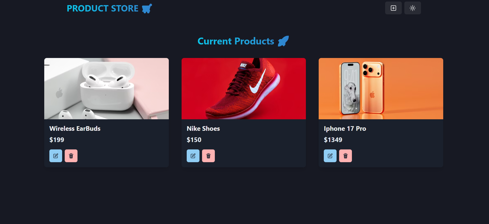
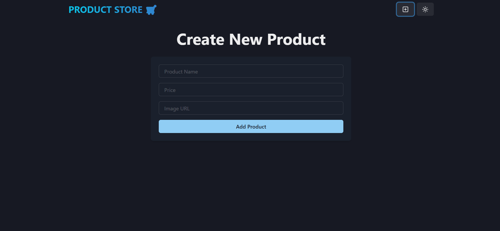

# Product Store


A modern full-stack product store application built with React on the frontend and Node.js/Express on the backend, featuring a clean UI with Chakra UI and state management with Zustand.

## 🚀 Features

- **Product Management**: Create, read, update, and delete products
- **Responsive Design**: Mobile-friendly interface using Chakra UI
- **Real-time Updates**: Seamless state management with Zustand
- **RESTful API**: Well-structured backend with Express and MongoDB
- **Modern Development**: Built with Vite for fast development and building

## � Screenshots

### Home Page

*Main dashboard showing all products*

### Create Product Page

*Form to add new products to the store*


## �🛠️ Tech Stack

### Frontend
- **React** - UI library
- **Chakra UI** - Component library
- **React Router** - Client-side routing
- **Zustand** - State management
- **Vite** - Build tool and dev server

### Backend
- **Node.js** - Runtime environment
- **Express** - Web framework
- **MongoDB** - NoSQL database
- **Mongoose** - ODM for MongoDB

## 📋 Prerequisites

Before running this application, make sure you have the following installed:

- Node.js (v14 or higher)
- MongoDB (local or cloud instance like MongoDB Atlas)
- npm or yarn package manager

## 🚀 Installation

1. **Clone the repository**
   ```bash
   git clone https://github.com/your-username/product-store.git
   cd product-store
   ```

2. **Install backend dependencies**
   ```bash
   npm install
   ```

3. **Install frontend dependencies**
   ```bash
   cd frontend
   npm install
   cd ..
   ```

4. **Environment Setup**
   
   Create a `.env` file in the root directory and add your MongoDB connection string:
   ```env
   MONGO_URI=your_mongodb_connection_string
   PORT=5000
   ```

## 🏃‍♂️ Usage

1. **Start the backend server**
   ```bash
   npm run dev
   ```
   The backend will run on `http://localhost:5000`

2. **Start the frontend (in a new terminal)**
   ```bash
   cd frontend
   npm run dev
   ```
   The frontend will run on `http://localhost:5173` (default Vite port)

3. **Open your browser** and navigate to `http://localhost:5173`

## 📡 API Endpoints

| Method | Endpoint | Description |
|--------|----------|-------------|
| GET | `/api/products` | Get all products |
| POST | `/api/products` | Create a new product |
| PUT | `/api/products/:id` | Update a product by ID |
| DELETE | `/api/products/:id` | Delete a product by ID |

### Product Schema
```json
{
  "name": "String",
  "price": "Number",
  "image": "String",
  "description": "String"
}
```

## 🏗️ Project Structure

```
product-store/
├── backend/
│   ├── config/
│   │   └── db.js
│   ├── controllers/
│   │   └── product.controller.js
│   ├── models/
│   │   └── product.model.js
│   ├── routes/
│   │   └── product.routes.js
│   └── server.js
├── frontend/
│   ├── public/
│   ├── src/
│   │   ├── components/
│   │   │   └── ui/
│   │   │       └── provider.jsx
│   │   ├── pages/
│   │   │   ├── components/
│   │   │   │   ├── Navbar.jsx
│   │   │   │   └── ProductCard.jsx
│   │   │   ├── CreatePage.jsx
│   │   │   └── HomePage.jsx
│   │   ├── store/
│   │   │   └── product.js
│   │   ├── app.jsx
│   │   └── main.jsx
│   ├── index.html
│   ├── package.json
│   └── vite.config.js
├── .env
├── package.json
└── README.md
```

## 🤝 Contributing

Contributions are welcome! Please feel free to submit a Pull Request.

1. Fork the project
2. Create your feature branch (`git checkout -b feature/AmazingFeature`)
3. Commit your changes (`git commit -m 'Add some AmazingFeature'`)
4. Push to the branch (`git push origin feature/AmazingFeature`)
5. Open a Pull Request

## 📄 License

This project is licensed under the MIT License - see the [LICENSE](LICENSE) file for details.

## 📞 Contact

If you have any questions or suggestions, feel free to open an issue or contact the maintainers.

---

Made with ❤️ using React and Node.js
